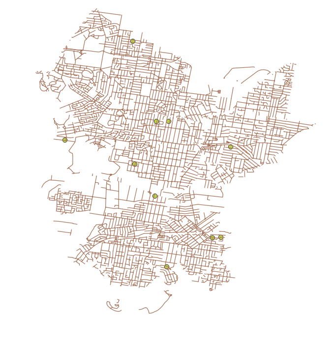

# Abstract
We demonstrate the feasibility of using the CNOSSOS (Common NOise aSSessment MethOdS) noise modelling framework in Australia. To do this, we implemented the code prepared by @Morley2015 using data sources for Bankstown, NSW. We discuss the limitations of the available data in the Australian context and identify enhancements which may be useful if the model were to be applied across Australia. 

# Introduction
Traffic noise is detrimentally linked to several health outcomes (@Babisch2006, @vanKempenandBabisch2012). Consequently, traffic noise modelling is increasingly important for understanding exposure and the impact on human health. This report examines the feasibility of extending the CNOSSOS framework as implemented by @Morley2015 to an Australian context. In this paper, Morley *et al.* describe and they compare the results achieved using 6 different levels of detailed data, an include code for the lowest and higest models.

We used the code published with this paper, along with data for Bankstown, NSW to demonstrate the CNOSSOS model can feasibly be used in Australia. Included alongside this report, we have created a PostGIS server with access to the source data and scripts which run the analysis. Because some of the datasets are restricted, these are not published in the public domain. Instead they have been made available through the Centre for Air pollution, energy and health Research (CAR) Data Analysis Technology (DAT) platform (http://cardat.github.io/). Access to this can be requested through the CAR data team (car.data\@sydney.edu.au).

We highlight a few issues and potential ways in which results may be improved upon. Primarily there would need to be careful consideration of data inputs, including overcoming any differences in data across the states and territories. 

Additionally, there are several other papers that could feasibly be used to enhance data inputs into the CNOSSOS code. For example, @MorleyGulliver2016 describes ways in which traffic flows on minor roads can be modelled which could improve the CNOSSOS model which uses constant hourly traffic rates for all minor roads.

# Methods

## Implementation of CNOSSOS code from Morley 2015
In @Morley2015, a number of different models are described (A through F), which rely on differing levels of detail in the input data. The authors provided code for two of these models in their github repository, located at ????.

As this project was a feasibility study we implemented the lowest resolution model (F), starting from the code in Morley's repository. We then deviated from the original scripts in the following ways:
- updated deprecated functions (???? ST_Line_Interpolate?)
- reorganised SQL scripts so that they were modularised in a logical order catering to code dependencies 
 
## Software
We implemented this on a PostGreSQL database (version ????) and did the analysis with SQL functions and scripts. 

## Data sources (and limitations?)
The data sources used for the low resolution code in this study are outlined in the table below with comparison to those used by Morley.

+---------------------+-------------------------------+-------------------------------+
| Input               | Bankstown Data Source         | Morley 2015 Data Source       |
+=====================+===============================+===============================+
| Landcover           |                               | CORINE 2006 v16 (~100 m       |
|                     |                               | precision)                    | 
|                     |                               | @EuropeanEnvironmentAgency2015b|
+---------------------+-------------------------------+-------------------------------+
| Building heights    |                               |                               |
|                     |                               |                               |
+---------------------+-------------------------------+-------------------------------+
| Road network        |                               |                               |
|                     |                               |                               |
+---------------------+-------------------------------+-------------------------------+
| Traffic flow        |                               |                               |
|                     |                               |                               |
+---------------------+-------------------------------+-------------------------------+
| Traffic composition |                               |                               |
|                     |                               |                               |
+---------------------+-------------------------------+-------------------------------+
| Traffic speed       |                               |                               |
|                     |                               |                               |
+---------------------+-------------------------------+-------------------------------+
| Topography          |                               |                               |
|                     |                               |                               |
+---------------------+-------------------------------+-------------------------------+
| Meteorological data |                               |                               |
|                     |                               |                               |
+---------------------+-------------------------------+-------------------------------+

## Data mapping

The Topograpy data used in our feasibility study was mapped to the CORINE codes used by the CNOSSOS model as follows:

+-----------------------------------+------------+-----------------------------------+
| LEP Landzoning value              | CORINE code| CORINE description                |
+===================================+============+===================================+
| Business Development              |   121      | Industrial or commercial units    |
|                                   |            |                                   |
+-----------------------------------+------------+-----------------------------------+
| Business Park                     |   121      | Industrial or commercial units    |
|                                   |            |                                   |
+-----------------------------------+------------+-----------------------------------+
| Enterprise Corridor               |   121      | Industrial or commercial units    |
|                                   |            |                                   |
+-----------------------------------+------------+-----------------------------------+
| General Industrial                |   121      | Industrial or commercial units    |
|                                   |            |                                   |
+-----------------------------------+------------+-----------------------------------+
| Infrastructure                    |   121      | Industrial or commercial units    |
|                                   |            |                                   |
+-----------------------------------+------------+-----------------------------------+
| Light Industrial                  |   121      | Industrial or commercial units    |
|                                   |            |                                   |
+-----------------------------------+------------+-----------------------------------+
| Primary Production Small Lots     |   121      | Industrial or commercial units    |
|                                   |            |                                   |
+-----------------------------------+------------+-----------------------------------+
| Unzoned land                      |   133      | Construction sites                |
|                                   |            |                                   |
+-----------------------------------+------------+-----------------------------------+
| High Density Residential          |   111      | Continuous urban fabric           |
|                                   |            |                                   |
+-----------------------------------+------------+-----------------------------------+
| Medium Density Residential        |   111      | Continuous urban fabric           |
|                                   |            |                                   |
+-----------------------------------+------------+-----------------------------------+
| Local Centre                      |   111      | Continuous urban fabric           |
|                                   |            |                                   |
+-----------------------------------+------------+-----------------------------------+
| Mixed Use                         |   111      | Continuous urban fabric           |
|                                   |            |                                   |
+-----------------------------------+------------+-----------------------------------+
| Neighbourhood Centre              |   111      | Continuous urban fabric           |
|                                   |            |                                   |
+-----------------------------------+------------+-----------------------------------+
| Low Density Residential           |   112      | Discontinuous urban fabric        |
|                                   |            |                                   |
+-----------------------------------+------------+-----------------------------------+
| National Parks and Nature Reserves|   313      | Mixed forest                      |
|                                   |            |                                   |
+-----------------------------------+------------+-----------------------------------+
| Private Recreation                |   142      | Sport and leisure facilities      |
|                                   |            | (Artificial, non-agricultural     |
|                                   |            | vegetated areas)                  |
+-----------------------------------+------------+-----------------------------------+
| Public Recreation                 |   142      | Sport and leisure facilities      |
|                                   |            | (Artificial, non-agricultural     |
|                                   |            | vegetated areas)                  |
+-----------------------------------+------------+-----------------------------------+
| Special Activities                |   142      | Sport and leisure facilities      |
|                                   |            | (Artificial, non-agricultural     |
|                                   |            | vegetated areas)                  |
+-----------------------------------+------------+-----------------------------------+
| Natural Waterways                 |   511      | Water courses                     |
|                                   |            |                                   |
+-----------------------------------+------------+-----------------------------------+

A full list of the CORINE Land Cover nomenclature conversion to Land Cover Classification system codes can be found here http://dd.eionet.europa.eu/vocabulary/landcover/clc 

# Results

## Creation of PostGIS server and data sources
As a deliverable

## Data visualisation from QGIS

# Discussion

## Limitations on data
Data availability across Australia can be inconsistent due largely to the extremely diverse population densities. While this means it may not be possible to apply the model in many areas, it is likely that there would be sufficient data to operate the model in areas of interest (i.e. populated regions).

Even where data is available, however, the lack of national standards means that the data may not be measured or represented consistently. These differences mean that mapping exercises may be necessary to achieve consistent outcomes from the model.

## Issues and proposed enhancements 

In implementing this model we encountered a number of issues with the orginal code. These included:
- Lack of sample data which made it difficult to ensure new data sources met the requirements of the model. It also made it difficult to debug issues that could have been related to the input data.
- Documentation of code was provided, but very minimal and often difficult to understand without detailed knowledge of the accompanying paper.
- There were a couple of deprecated functions which needed to be updated to get the code to run in the more recent version of PostGIS. 

The choice of platform and code language (PostGIS and SQL) were difficult choices for re-implementing this model. The lack of code breakpoints and Integrated Development Environment made debugging issues with code difficult. Were the study to be extended further, it might be worth considering an alternative analysis environment (e.g. R or Python). 

# Conclusion

If this study were to be expanded to cover more of Australia, it would be worth considering the 

# Acknowledgments
With thanks to our colleages Bridget Beesley, Steve van der Hoorn and Jane Heyworth in University of Western Australia, who provided support and advice on getting the orginal code to run. 

# References

# Abstract

