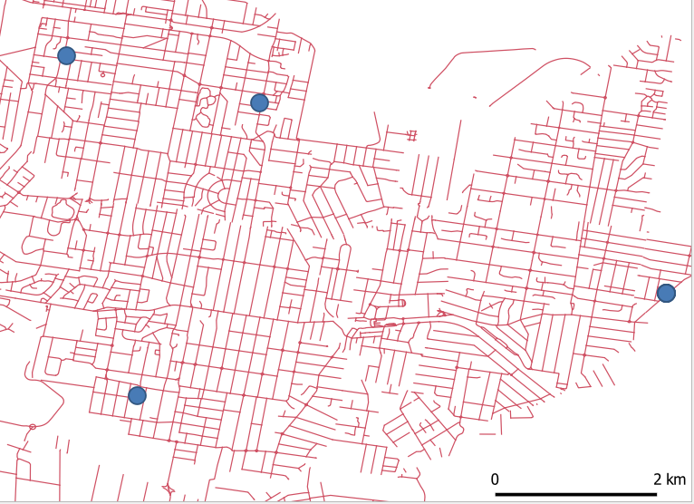
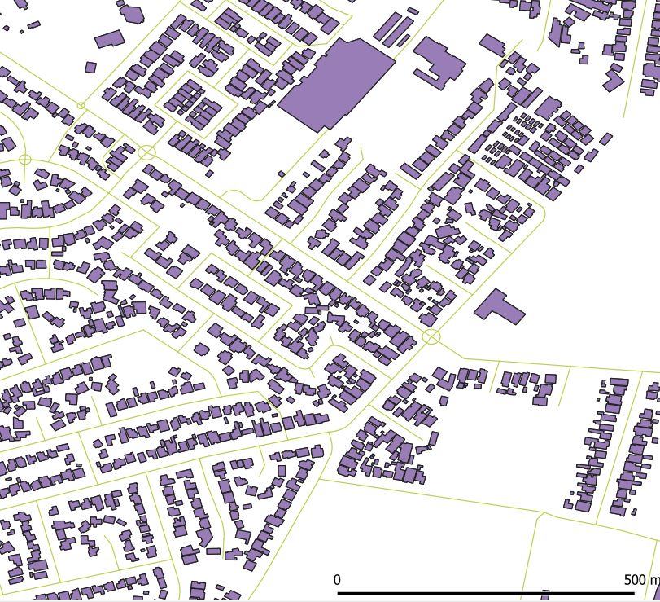
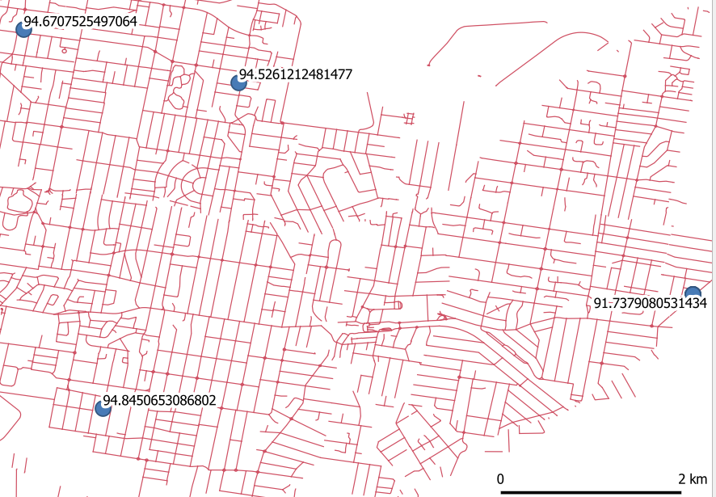

# Abstract
We demonstrate the feasibility of using the CNOSSOS (Common NOise aSSessment MethOdS) noise modelling framework in Australia. To do this, we implemented the code prepared by @Morley2015 using data sources for Bankstown, NSW. We discuss the limitations of the available data in the Australian context and identify enhancements which may be useful if the model were to be applied across Australia. 

# Introduction
Traffic noise is detrimentally linked to several health outcomes (@Babisch2006, @VanKempen2012a, @Bjork2006, @Sorensen2012). Consequently, traffic noise modelling is increasingly important for understanding exposure and the impact on human health. 

The aim of this report is to examine the feasibility of extending the CNOSSOS framework as implemented by @Morley2015 to an Australian context. In that paper the authors compare the results achieved using 6 different levels of detailed data, and include code for the least and most detailed models. Our report describes our attempts at getting the low resolution model to run using data for Bankstown, NSW.

We used the code published with this paper, along with data for Bankstown, NSW to demonstrate the CNOSSOS model can feasibly be used in Australia. Included alongside this report, we have created a PostGIS server with access to the source data and scripts which run the analysis. Because some of the datasets are restricted, these are not published in the public domain. Instead they have been made available through the Centre for Air pollution, energy and health Research (CAR) Data Analysis Technology (DAT) platform (http://cardat.github.io/). Access to this can be requested through the CAR data team (car.data\@sydney.edu.au).

We highlight a few issues and potential ways in which results may be improved. Primarily there would need to be careful consideration of data inputs, including overcoming any differences in data standards across the states and territories. 

Additionally, there are several other papers that could feasibly be used to enhance data inputs into the CNOSSOS code. For example, @Morley2016 describe ways in which traffic flows on minor roads can be modelled. This could improve the CNOSSOS model, which assumes constant hourly rate across all minor roads.

# Methods

## Implementation of CNOSSOS code from Morley et al. 2015
In @Morley2015, a number of different models are described (A through F), which rely on differing levels of detail in the input data. The authors provided code for two of these models in their github repository, located at https://github.com/dwmorley/BioshareCNOSSOS_EU.

As this project was a feasibility study we implemented the lowest resolution model (F), starting from the code in Morley's repository. We then deviated from the original scripts in the following ways:

 * Updated deprecated functions 
   + ST_Line_Interpolate_Point updated to ST_LineInterpolatePoint
   + ST_Line_Locate_Point updated to ST_LineLocatePoint
 * Reorganised SQL scripts so that they were modularised in a logical order catering to code dependencies 
 
When we implemented this model we randomly generated 10 receptor points, and the model estimates the noise at each of the points.

## Software
We implemented this on a PostGIS database (version 2.3 running PostgreSQL 9.6.15 on x86_64-pc-linux-gnu (Ubuntu 9.6.15-1.pgdg16.04+1), compiled by gcc (Ubuntu 5.4.0-6ubuntu1~16.04.11) 5.4.0 20160609, 64-bit) and did the analysis with SQL functions and scripts.

## Data sources 
The data sources used for the low resolution code in this study are outlined in Table 1 along with those used by Morley.

+---------------------+-------------------------------+-------------------------------+
| Input               | Bankstown Data Source         | Morley 2015 Data Source       |
+=====================+===============================+===============================+
| Landcover           | @OEH2017                      | CORINE 2006 v16 (~100 m       |
|                     |                               | precision)                    | 
|                     |                               | @EuropeanEnvironmentAgency2015b |
+---------------------+-------------------------------+-------------------------------+
| Building heights    | @PSMA2019                     | 1) 50 m grid generalised Landmap LiDAR |
|                     |                               | 2) Constant value according to CORINE urban extent |
+---------------------+-------------------------------+-------------------------------+
| Road network        | @PitneyBowes2012              | Ordnance Survey, 2015. Meridian 2. |
|                     |                               | (accessed July 2015)          |
+---------------------+-------------------------------+-------------------------------+
| Traffic flow        | As for @Morley2015            | ESCAPE/UK Department of Transport |
|                     |                               | modelled traffic flow         |
|                     |                               | @Eeftens2012                  |
+---------------------+-------------------------------+-------------------------------+
| Traffic composition | As for @Morley2015            | 10% heavy 90% light vehicles as according to CRTN |
|                     |                               | @DepartmentofTransport2013    |
+---------------------+-------------------------------+-------------------------------+
| Traffic speed       | @PitneyBowes2012              | Local legal maximum limit     |
|                     |                               |                               |
+---------------------+-------------------------------+-------------------------------+
| Topography          | Flat plane (height assumed to | Flat plane (height assumed to |
|                     | be 1m above ground level)     | be 1m above ground level)     |
+---------------------+-------------------------------+-------------------------------+
| Meteorological data | **wind data** test values     | UK Met Office air temperature |
|                     | Annual average of 2003-2010   | and wind direction            |  
|                     | **temperature data**          | @MetOffice2015                |
|                     | downloaded from BoM           |                               |
+---------------------+-------------------------------+-------------------------------+

## Data category matching

The landcover data used in our feasibility study came from a NSW State Government source and the categories were matched to the CORINE codes used by Morley 2015 model as follows:

+-----------------------------------+------------+-----------------------------------+
| LEP Landzoning value              | CORINE code| CORINE description                |
+===================================+============+===================================+
| Business Development              |   121      | Industrial or commercial units    |
|                                   |            |                                   |
+-----------------------------------+------------+-----------------------------------+
| Business Park                     |   121      | Industrial or commercial units    |
|                                   |            |                                   |
+-----------------------------------+------------+-----------------------------------+
| Enterprise Corridor               |   121      | Industrial or commercial units    |
|                                   |            |                                   |
+-----------------------------------+------------+-----------------------------------+
| General Industrial                |   121      | Industrial or commercial units    |
|                                   |            |                                   |
+-----------------------------------+------------+-----------------------------------+
| Infrastructure                    |   121      | Industrial or commercial units    |
|                                   |            |                                   |
+-----------------------------------+------------+-----------------------------------+
| Light Industrial                  |   121      | Industrial or commercial units    |
|                                   |            |                                   |
+-----------------------------------+------------+-----------------------------------+
| Primary Production Small Lots     |   121      | Industrial or commercial units    |
|                                   |            |                                   |
+-----------------------------------+------------+-----------------------------------+
| Unzoned land                      |   133      | Construction sites                |
|                                   |            |                                   |
+-----------------------------------+------------+-----------------------------------+
| High Density Residential          |   111      | Continuous urban fabric           |
|                                   |            |                                   |
+-----------------------------------+------------+-----------------------------------+
| Medium Density Residential        |   111      | Continuous urban fabric           |
|                                   |            |                                   |
+-----------------------------------+------------+-----------------------------------+
| Local Centre                      |   111      | Continuous urban fabric           |
|                                   |            |                                   |
+-----------------------------------+------------+-----------------------------------+
| Mixed Use                         |   111      | Continuous urban fabric           |
|                                   |            |                                   |
+-----------------------------------+------------+-----------------------------------+
| Neighbourhood Centre              |   111      | Continuous urban fabric           |
|                                   |            |                                   |
+-----------------------------------+------------+-----------------------------------+
| Low Density Residential           |   112      | Discontinuous urban fabric        |
|                                   |            |                                   |
+-----------------------------------+------------+-----------------------------------+
| National Parks and Nature Reserves|   313      | Mixed forest                      |
|                                   |            |                                   |
+-----------------------------------+------------+-----------------------------------+
| Private Recreation                |   142      | Sport and leisure facilities      |
|                                   |            | (Artificial, non-agricultural     |
|                                   |            | vegetated areas)                  |
+-----------------------------------+------------+-----------------------------------+
| Public Recreation                 |   142      | Sport and leisure facilities      |
|                                   |            | (Artificial, non-agricultural     |
|                                   |            | vegetated areas)                  |
+-----------------------------------+------------+-----------------------------------+
| Special Activities                |   142      | Sport and leisure facilities      |
|                                   |            | (Artificial, non-agricultural     |
|                                   |            | vegetated areas)                  |
+-----------------------------------+------------+-----------------------------------+
| Natural Waterways                 |   511      | Water courses                     |
|                                   |            |                                   |
+-----------------------------------+------------+-----------------------------------+

# Results

## Creation of PostGIS server and data sources
We have set up a PostGIS database incorporating the Bankstown data, and along with the SQL scripts and readme in the open source software repository https://github.com/cardat/CNOSSOS_au_feasibility_report. In the scripts_and_analysis folder can be found the codes to run the low resolution model. 

## Data visualisation from QGIS
The data from each of the layers can be visualised through QGIS (https://qgis.org/en/site/). See Fig 1-3 as examples.








## Noise estimates
The analysis results in a table of noise measurements at each receptor point. The results are given it deciBels (dB) and measured using LAeq (A-weighted equivalent continuous sound level). The table includes:

* Information about the receptor point (id, geometry, gps coordinates, optional description).
* Hourly noise averages.
* Noise averages for day, evening and night periods.
* Noise averages for the 16 hour period 07:00-23:00.
A full list of variables can be found in Table 3.

```{r, tabresultsvariablescsv, echo = F}
knitr::opts_chunk$set(fig.pos = "H", out.extra = "", collapse = T, fig.width = 2)
results <- read.csv('figures_and_tables/results_table_variables.csv', stringsAsFactors = F)
names(results)<-c("Variable name","Description")
knitr::kable(results, format='pandoc', caption = 'Results table variables')
```

Table 4 gives some example output data (truncated to fit to the page)

```{r, tabexampleoutput, echo = F}
results <- read.csv('data_derived/sample_output.csv', stringsAsFactors = F)
sample_results<-results[,c(1,4,7,10,13,16,19)]
knitr::kable(sample_results, format='pandoc', caption = 'Sample noise averages from analysis at 10 randomly generated receptor points')
```

# Discussion

## Limitations on data
Data availability across Australia can be inconsistent due largely to the extremely diverse population densities. While this means it may not be possible to apply the model in many areas, it is likely that there would be sufficient data to operate the model in areas of interest (i.e. populated regions).

Even where data is available, however, the lack of national standards means that the data may not be measured or represented consistently. These differences mean that matching exercises may be necessary to achieve consistent outcomes from the model.


## Issues and proposed enhancements 

In implementing this model we encountered a number of issues with the original code. These included:

 * Lack of sample data which made it difficult to ensure new data sources met the requirements of the model. It also made it difficult to debug issues that could have been related to the input data.
 * Documentation of code was provided, but it was very minimal and often difficult to understand without detailed knowledge of the accompanying paper.
 * There were a couple of deprecated functions which needed to be updated to get the code to run in the more recent version of PostGIS. 

If this study were to be further extended, we would recommend a different coding framework for the project. 

 * Best practice is to have functions defined in individual files rather than in a single SQL file.
 * Using an R project to connect and run the scripts would enable more effective scripting, and easier debugging.

This study has not tested for scale and only uses 10 receptor points which are randomly generated. Expanding the results to larger areas could create performance issues. 

Using the high resolution model would also improve the accuracy of estimations as it accounts for variables such as elevation. Additionally the model results could be improved through more detailed data inputs.

## Validation of Results
There were no attempts made to validate the results from this experiment, except to check that the results were in the expected range for traffic noise measurements (see Table 4 for sample results). 

There was data provided to the Centre for Air pollution, energy and health Research (CAR) for noise readings in various suburbs of Sydney (Penthurst, Oatley, Mt Annan, Bradbury, Woy Woy, Wyoming, Glebe, Ashbury, St Ives, Kellyville, Castle Hill). These data could potentially be used for validating the results achieved in the CNOSSOS model in these regions.

# Conclusion


It is possible to use the CNOSSOS noise modelling framework in Australia, at least in major cities for which we have data.

There is still significant work that would need to be done to:

 * Validate the model against readings from a similar source
 * Add realistic data for wind and receptors, rather than the randomly generated numbers and points used in this model (i.e. use real wind data, and generate receptor points 1 metre from the facade of buildings next to the nearest road)
 * Map differences in data across states and territories to ensure consistent and comparable results
 * Test the performance of the model with large scale data
 
# Acknowledgments
The work by Ivan Hanigan and Christy Geromboux was funded by the Clean Air and Urban Landscapes (CAUL) hub of the Australian Government’s National and Environmental Science Programme (NESP).
TODO Acknowledge support from Prof Jane Heyworth and Prof Geoff Morgan.
Financial support was also provided by the Centre for Air pollution, energy and health Research (CAR, http://www.car-cre.org.au) an Australian National Health and Medical Research Council (NHMRC) Centre of Research Excellence; and the Air Pollution, Traffic Exposures and Mortality and Morbidity in Older Australians (APTEMA) Study.

This research is undertaken with the assistance of resources from the Collaborative Environment for Scholarly Analysis and Synthesis (CoESRA; https://coesra.tern.org.au).

Thanks also to our colleagues Bridget Beesley, Steve van der Hoorn and Jane Heyworth at University of Western Australia, who provided support and advice on getting the original code to run. 

# References


